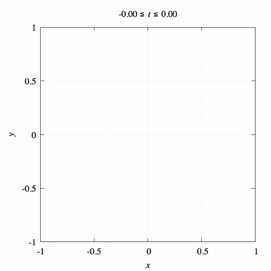
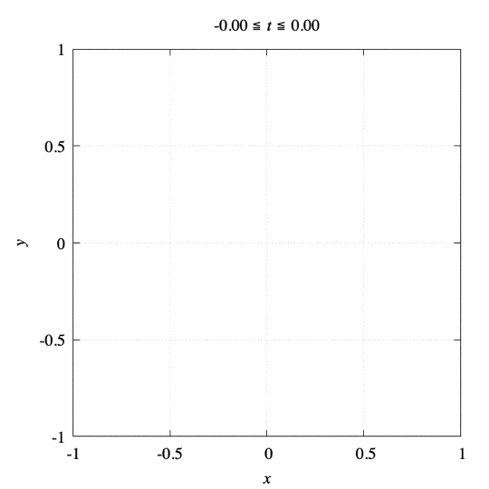
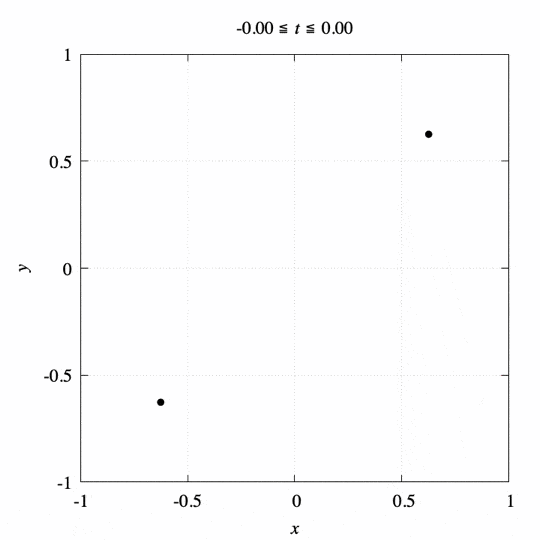
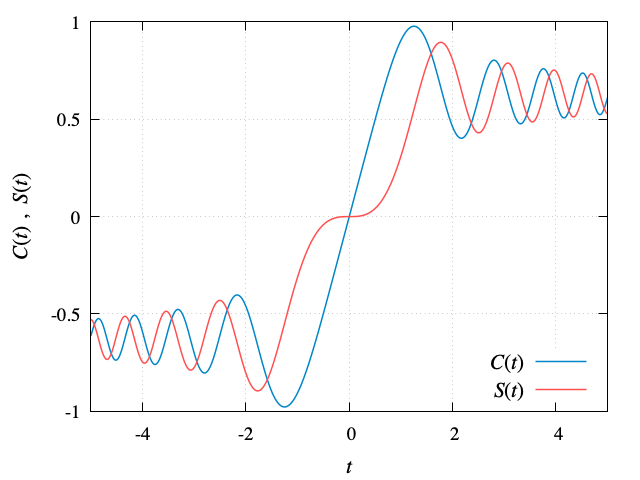

# Euler Spiral
This gnuplot script generates animation of **Euler Spiral**.

<!-- ## Documents
The details of the script and comparison of the outputted samples are documented in my blog.
My blog is written in Japanese, but you can translate it in your language by GTranslate.  
- [Japanese (original)](https://hiroloquy.com/2020/09/03/gnuplot_compare_9_terminals/)
- [English (auto translated)](https://hiroloquy-com.translate.goog/2020/09/03/gnuplot_compare_9_terminals/?_x_tr_sl=ja&_x_tr_tl=en&_x_tr_hl=ja&_x_tr_pto=wapp) -->

## Demo
|||||
|:---:|:---:|:---:|:---:|
|**Only curve**|**Curve with limit points**|**Curve with osculating circles**|**Curve with the points and the circles**|

<!-- ## Features -->
## Theoretical formulas
### Parametric equations


### Limit points
 &emsp; (double sign corresponds)

### Radius of curvature 


### Center of curvature 


### More details
[**My blog (in English)**](https://hirossoliloquy.blogspot.com/2020/06/euler-spiral-animation-gnuplot.html)

<!-- # Operating environment -->
## Requirement
- macOS Catalina 10.15.6, Monterey 12.1 / Macbook Air (M1, 2020)
- gnuplot version 5.4 patchlevel 2

<!-- # Installation -->
 
## Usage
```sh
git clone https://github.com/hiroloquy/euler-spiral.git
cd euler-spiral
gnuplot
load 'euler_spiral.plt'
```

## Note
If you want to output the graph of Fresnel integrals C(t) and S(t), load the script ''[fresnel_graph.plt](fresnel_graph.plt)''.


## Author
* Hiro Shigeyoshi
* Twitter: [@hiroloquy](https://twitter.com/hiroloquy)

### Blog
https://hirossoliloquy.blogspot.com/2020/06/euler-spiral-animation-gnuplot.html

### YouTube
https://youtu.be/vz9N5GG8Tfw  
[![Euler Spiral (Clothoid) Animation [gnuplot]](http://img.youtube.com/vi/VMlZzhmW3vg/0.jpg)](https://youtu.be/VMlZzhmW3vg "Euler Spiral (Clothoid) Animation [gnuplot]")

## License
"euler-spiral" is under [MIT license](https://github.com/hiroloquy/euler-spiral/blob/master/LICENSE).
 
